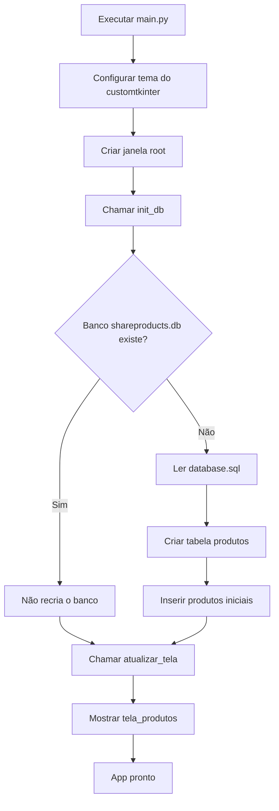
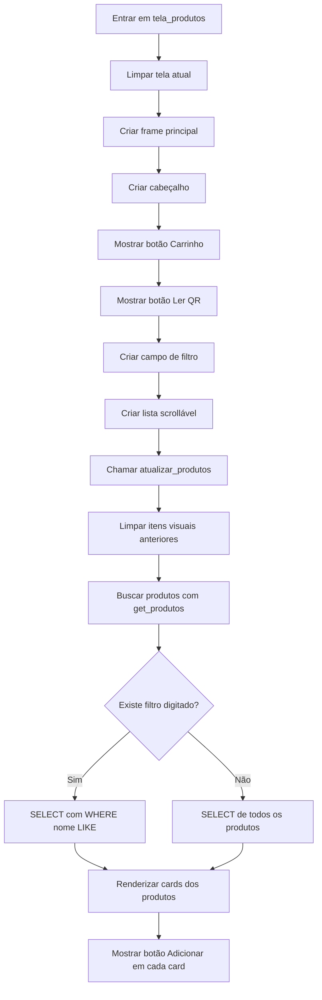
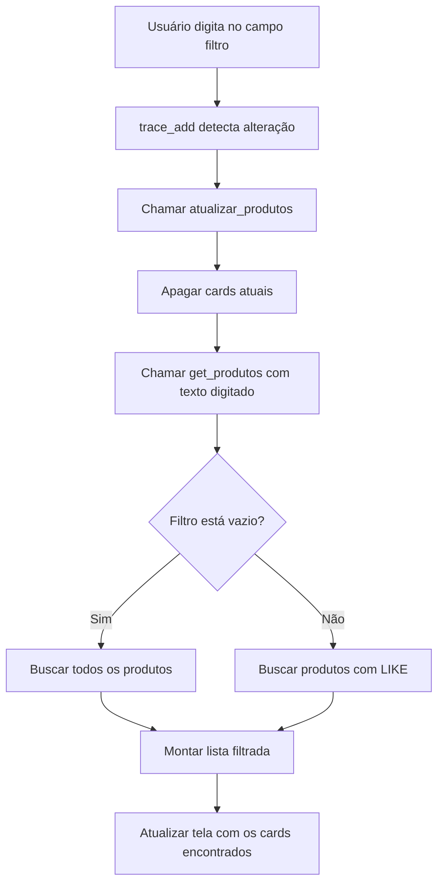
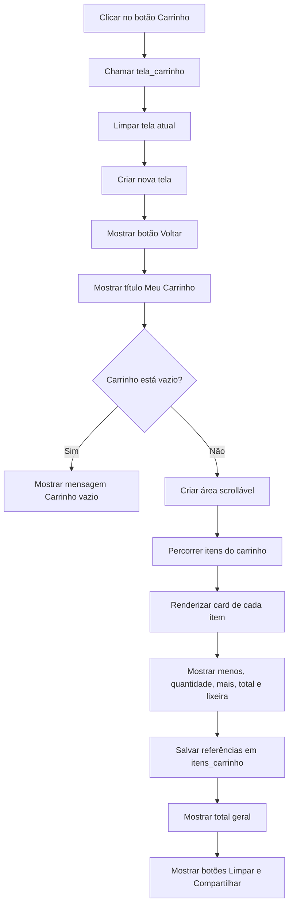
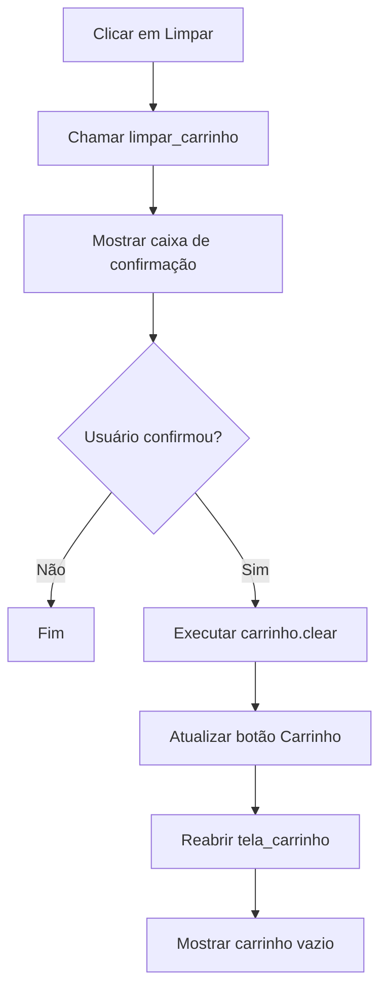
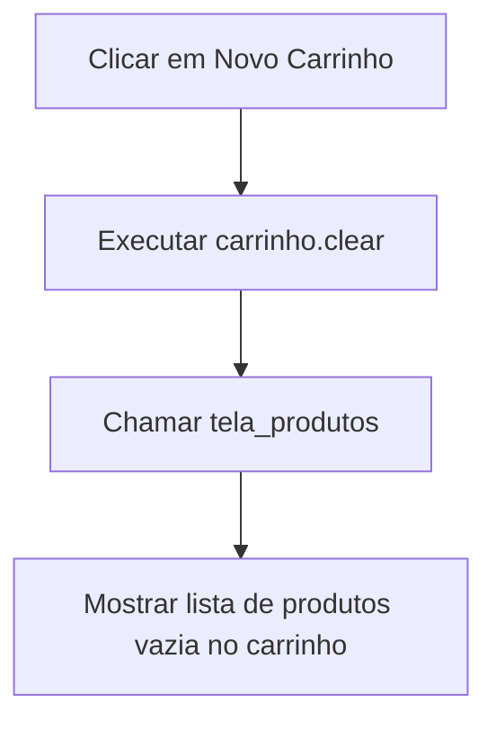
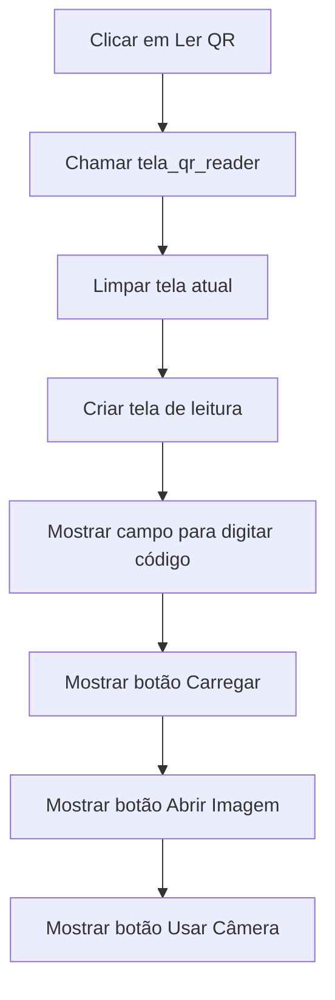
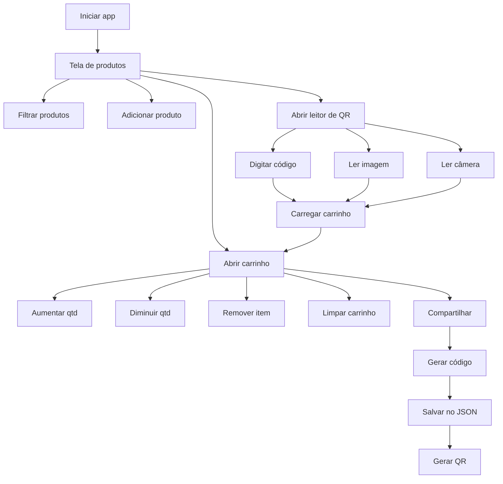

# Fluxogramas do Projeto Share Products

Arquivo com todos os fluxogramas do projeto, separados por ação do usuário.

## 1) Abrir o app



## 2) Ver produtos na Tela 1



## 3) Pesquisar produto na Tela 1



## 4) Adicionar produto ao carrinho

```mermaid
flowchart TD
    A[Clicar em Adicionar] --> B[Chamar adicionar(produto)]
    B --> C{Produto já existe no carrinho?}
    C -- Sim --> D[Somar 1 na qtd]
    C -- Não --> E[Criar item no carrinho com qtd 1]
    D --> F[Mostrar notificação de sucesso]
    E --> F
    F --> G[Atualizar texto do botão Carrinho]
```

## 5) Abrir Tela 2 do carrinho



## 6) Aumentar quantidade de um item

```mermaid
flowchart TD
    A[Clicar no botão +] --> B[Chamar alterar_qtd(pid, 1)]
    B --> C{Item existe no carrinho?}
    C -- Não --> D[Fim]
    C -- Sim --> E[Somar 1 na qtd]
    E --> F{Qtd ficou menor ou igual a 0?}
    F -- Não --> G[Chamar atualizar_item_carrinho]
    G --> H[Atualizar label da quantidade]
    H --> I[Atualizar total do item]
    I --> J[Atualizar total geral]
    J --> K[Atualizar botão Carrinho]
```

## 7) Diminuir quantidade de um item

```mermaid
flowchart TD
    A[Clicar no botão -] --> B[Chamar alterar_qtd(pid, -1)]
    B --> C{Item existe no carrinho?}
    C -- Não --> D[Fim]
    C -- Sim --> E[Subtrair 1 da qtd]
    E --> F{Qtd ficou menor ou igual a 0?}
    F -- Não --> G[Atualizar item visualmente]
    F -- Sim --> H[Chamar remover(pid)]
```

## 8) Remover item do carrinho

```mermaid
flowchart TD
    A[Clicar na lixeira] --> B[Chamar remover(pid)]
    B --> C{Item existe no carrinho?}
    C -- Não --> D[Fim]
    C -- Sim --> E[Remover item do dicionário carrinho]
    E --> F[Mostrar notificação Removido]
    F --> G[Atualizar botão Carrinho]
    G --> H{Item tem card desenhado na tela?}
    H -- Não --> I[Fim]
    H -- Sim --> J[Destruir card visual]
    J --> K[Remover referência de itens_carrinho]
    K --> L{Ainda restam itens no carrinho?}
    L -- Sim --> M[Atualizar total geral]
    L -- Não --> N[Reabrir tela_carrinho]
```

## 9) Limpar carrinho inteiro



## 10) Compartilhar carrinho

```mermaid
flowchart TD
    A[Clicar em Compartilhar] --> B[Chamar tela_qr]
    B --> C[Limpar tela atual]
    C --> D[Criar tela de compartilhamento]
    D --> E[Mostrar mensagem Carrinho salvo]
    E --> F[Percorrer carrinho]
    F --> G[Montar lista itens com id, qty e preco]
    G --> H[Chamar salvar_carrinho(itens)]
    H --> I[Gerar código único]
    I --> J{Arquivo carrinhos.json existe?}
    J -- Sim --> K[Ler JSON existente]
    J -- Não --> L[Criar estrutura vazia]
    K --> M[Calcular total]
    L --> M
    M --> N[Salvar carrinho no JSON]
    N --> O[Retornar código]
    O --> P[Mostrar código na tela]
    P --> Q[Gerar imagem QRCode]
    Q --> R[Exibir QR na interface]
    R --> S[Mostrar botão Copiar]
    S --> T[Mostrar botão Novo Carrinho]
```

## 11) Copiar código do carrinho

```mermaid
flowchart TD
    A[Clicar em Copiar] --> B[Executar pyperclip.copy(codigo)]
    B --> C[Mostrar notificação Copiado]
    C --> D[Fim]
```

## 12) Criar novo carrinho depois de compartilhar



## 13) Abrir tela para ler QR ou código



## 14) Carregar carrinho digitando o código

```mermaid
flowchart TD
    A[Digitar código e clicar em Carregar] --> B[Chamar carregar_qr(codigo)]
    B --> C[Executar strip e upper no código]
    C --> D[Chamar carregar_carrinho]
    D --> E{Arquivo carrinhos.json existe?}
    E -- Não --> F[Retornar None]
    E -- Sim --> G[Ler JSON e buscar código]
    G --> H{Código encontrado?}
    H -- Não --> I[Mostrar erro Carrinho não encontrado]
    H -- Sim --> J[Limpar carrinho atual]
    J --> K[Percorrer itens carregados]
    K --> L[Buscar produto real com get_produto(id)]
    L --> M{Produto existe no banco?}
    M -- Não --> N[Pular item]
    M -- Sim --> O[Inserir produto no carrinho]
    O --> P[Mostrar notificação Carrinho carregado]
    P --> Q[Abrir tela_carrinho]
```

## 15) Ler carrinho por imagem

```mermaid
flowchart TD
    A[Clicar em Abrir Imagem] --> B[Chamar ler_imagem]
    B --> C[Abrir seletor de arquivos]
    C --> D{Usuário escolheu imagem?}
    D -- Não --> E[Fim]
    D -- Sim --> F[Ler imagem com cv2.imread]
    F --> G[Decodificar com pyzbar.decode]
    G --> H{QR encontrado?}
    H -- Não --> I[Mostrar erro QR Code não encontrado]
    H -- Sim --> J[Extrair texto do QR]
    J --> K[Chamar carregar_qr(codigo)]
    K --> L[Montar carrinho e abrir tela_carrinho]
    G --> M{Erro na leitura?}
    M -- Sim --> N[Mostrar mensagem de erro]
```

## 16) Ler carrinho pela câmera

```mermaid
flowchart TD
    A[Clicar em Usar Câmera] --> B[Chamar ler_camera]
    B --> C[Abrir câmera com cv2.VideoCapture]
    C --> D{Câmera abriu?}
    D -- Não --> E[Mostrar erro Câmera não disponível]
    D -- Sim --> F[Mostrar aviso ESC para cancelar]
    F --> G[Entrar no loop de captura]
    G --> H[Ler frame da câmera]
    H --> I{Leitura do frame ok?}
    I -- Não --> J[Sair do loop]
    I -- Sim --> K[Decodificar frame com pyzbar.decode]
    K --> L{QR encontrado?}
    L -- Sim --> M[Fechar câmera e janelas]
    M --> N[Chamar carregar_qr(codigo)]
    N --> O[Abrir tela_carrinho]
    L -- Não --> P[Mostrar frame na janela]
    P --> Q{Tecla ESC pressionada?}
    Q -- Sim --> R[Sair do loop]
    Q -- Não --> G
    R --> S[Fechar câmera e janelas]
    J --> S
```

## 17) Estrutura resumida de todas as ações


